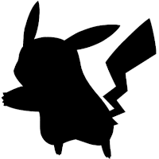
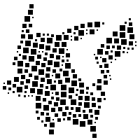

# image-blockstirr
Transform images into animated stirred blocks GIFs




## Setup
To setup the environment run
```
python3 -m venv .venv
source .venv/bin/activate
pip install -r requirements.txt
```

## Usage
Activate the virtual environment with
```
source .venv/bin/activate
```

Render the animation with
```
python main.py --inputname=source_image.png --outputname=animation_name --frames=5 --merge
```

## Options
| Name         | Type    | Required | Purpose                                        |
|--------------|:-------:|:--------:|------------------------------------------------|
| `inputname`  | string  | Yes      | Full name of the input image                   |
| `outputname` | string  | Yes      | Name of the output image without the extension |
| `frames`     | integer | No       | Number of frames to render                     |
| `merge`      | flag    | No       | Switch to merge images to a GIF                |
| `norender`   | flag    | No       | Skip rendering frames and render the GIF       |

## Philosophy
Just because it can be done.
